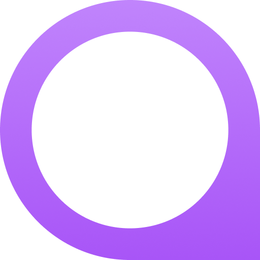

<br />
<div align="center">
  <a href="https://github.com/meragix/qora">
    
  </a>

  <h3 align="center">Qora</h3>

  <p align="center">
     Server-state management for Dart and Flutter.
    <br />
    <a href="https://qora.meragix.dev"><strong>Explore the docs »</strong></a>
    <br />
    <br />
    <a href="https://github.com/meragix/qora/tree/main/examples">View Examples</a>
    &middot;
    <a href="https://github.com/meragix/qora/issues/new">Report Bug</a>
    &middot;
    <a href="https://github.com/meragix/qora/issues/new">Request Feature</a>
  </p>

  <div align="center">
    <a href="https://pub.dev/packages/qora"></a>
    <a href="https://github.com/meragix/qora/actions/workflows/flutter.yml"></a>
    <a href="https://pub.dev/packages/qora/score"></a>
    <a href="https://pub.dev/packages/qora/score"></a>
    <a href="LICENSE"></a>
    <a href="https://github.com/meragix/qora"></a>
  </div>
</div>
<br />

Qora is what server-state management looks like when it's built for Flutter from the ground up. Fetch, cache, synchronize, and mutate server data with a declarative API, without writing `isLoading` flags, `try/catch` blocks, or cache invalidation logic ever again.

If you've used [TanStack Query](https://tanstack.com/query) on the web, this will feel familiar. If you haven't, it's the pattern where server data is treated as a synchronized cache with its own lifecycle, not as global UI state.

---

## Quick Start

```yaml
dependencies:
  qora_flutter: ^1.0.0
```

```dart
void main() {
  final client = QoraClient();

  runApp(
    QoraScope(
      client: client,
      child: const MyApp(),
    ),
  );
}
```

Now bind any query to the widget tree:

```dart
QoraBuilder<User>(
  queryKey: ['users', userId],
  fetcher: () => api.getUser(userId),
  builder: (context, state, fetchStatus) => switch (state) {
    Loading(:final previousData) => previousData != null
        ? UserCard(previousData)
        : const CircularProgressIndicator(),
    Success(:final data) => UserCard(data),
    Failure(:final error, :final previousData) => previousData != null
        ? Column(children: [UserCard(previousData), ErrorBanner(error)])
        : ErrorScreen(error),
    _ => const SizedBox.shrink(),
  },
)
```

The same API works in pure Dart:

```dart
final user = await client.fetchQuery<User>(
  key: ['users', userId],
  fetcher: () => api.getUser(userId),
  options: const QoraOptions(staleTime: Duration(minutes: 5)),
);
```

---

## Capabilities

| Core | Description |
|------|-------------|
| Stale-while-revalidate | Show cached data instantly, refresh in the background |
| Request deduplication | 10 widgets, same key → 1 network call |
| Two-axis state model | `QoraState` (data lifecycle) and `FetchStatus` (engine status) are fully independent |
| Automatic retry | Exponential backoff with configurable policy |
| Optimistic updates | Update UI before the server responds, roll back on failure |
| Reactive invalidation | Invalidate a key → every subscriber rebuilds |

| Advanced | Description |
|----------|-------------|
| Offline mutation queue | FIFO replay on reconnect with jitter-based backoff |
| Infinite queries | Paginated data with `maxPages` memory window |
| Obfuscation-safe persistence | Disk cache that survives Dart obfuscation in release builds |
| Zero code generation | Pure Dart 3 sealed classes + pattern matching, no `build_runner` |
| DevTools overlay | In-app debug panel (debug mode only, zero overhead in release) |

---

## Why Qora?

Existing state management solutions for Flutter (Bloc, Riverpod, Provider) are excellent for *UI state*: theming, auth, form state, navigation. But server data is different. It has its own concerns: loading states, error states, staleness, background refresh, cache invalidation, optimistic updates, offline queues.

Mixing these concerns into a general-purpose state store means you're reinventing the same patterns for every feature. Qora handles them all in one place: one cache, one lifecycle, one API.

---

## Packages

| Package | CI | Pub |
|---------|----|-----|
| [qora](https://pub.dev/packages/qora) | [](https://github.com/meragix/qora/actions/workflows/dart.yml) | [](https://pub.dev/packages/qora) |
| [qora_flutter](https://pub.dev/packages/qora_flutter) | [](https://github.com/meragix/qora/actions/workflows/flutter.yml) | [](https://pub.dev/packages/qora_flutter) |
| [qora_hooks](https://pub.dev/packages/qora_hooks) | [](https://github.com/meragix/qora/actions/workflows/hooks.yml) | [](https://pub.dev/packages/qora_hooks) |
| [qora_devtools_overlay](https://pub.dev/packages/qora_devtools_overlay) | [](https://github.com/meragix/qora/actions/workflows/overlay.yml) | [](https://pub.dev/packages/qora_devtools_overlay) |

---

## Install

### Flutter

```yaml
dependencies:
  qora_flutter: ^1.0.0
```

### Pure Dart

```yaml
dependencies:
  qora: ^1.0.0
```

### DevTools overlay (in-app debug panel)

```yaml
dev_dependencies:
  qora_devtools_overlay: ^1.0.0
```

```dart
void main() {
  final tracker = OverlayTracker();
  final client = QoraClient(tracker: tracker);

  runApp(
    QoraInspector(
      tracker: tracker,
      client: client,
      child: QoraScope(
        client: client,
        child: const MyApp(),
      ),
    ),
  );
}
```

The `QoraInspector` widget is stripped from release builds automatically; zero overhead in production.

---

## DevTools

Qora ships with developer tooling across two surfaces.

**In-app overlay** *(stable)*: a draggable panel inside your running app, similar to TanStack Query's overlay. Add `qora_devtools_overlay` to `dev_dependencies` and wrap your app with `QoraInspector`. Zero overhead in release builds.

**IDE extension** *(under development)*: a native tab inside Flutter DevTools with live query inspection, mutation timeline, network activity monitoring, and a query dependency graph. Not yet published on pub.dev. Use the in-app overlay in the meantime.

Both surfaces share the same event protocol and are independent of each other.

---

## Documentation

Full guides, API reference, and examples: **[qora.meragix.dev](https://qora.meragix.dev)**

- [What is Qora?](https://qora.meragix.dev/getting-started/what-is-qora)
- [Quick Start](https://qora.meragix.dev/getting-started/quick-start)
- [Flutter Integration](https://qora.meragix.dev/flutter-integration/setup)
- [Optimistic Updates](https://qora.meragix.dev/guides/optimistic-updates)
- [DevTools](https://qora.meragix.dev/devtools)

---

## Contributing

Contributions are welcome. See [CONTRIBUTING.md](CONTRIBUTING.md) for the development workflow, testing guidelines, and architectural principles. For a sense of where the project is heading, check [ROADMAP.md](ROADMAP.md).

---

## License

This project is licensed under the MIT License; see [LICENSE](LICENSE).

## Acknowledgments

- [TanStack Query](https://tanstack.com/query/latest): the pattern that inspired Qora
- [Melos](https://melos.invertase.dev): monorepo tooling
- [Docus](https://docus.dev): documentation site
- [Lucide Icons](https://lucide.dev): icons
