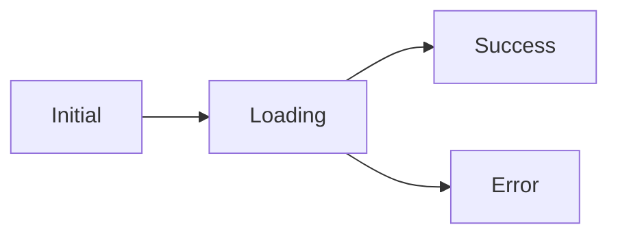

# Qora Documentation

Documentation officielle pour Qora v0.1.0 - Bibliothèque de gestion d'état serveur pour Dart et Flutter.

## 📁 Structure de la documentation

```
1. getting-started
   ├── what-is-qora          ← comparaison Riverpod/Bloc/dio+setState
   ├── installation
   ├── quick-start           ← QoraScope + QoraBuilder en 20 lignes, RUNNABLE
   ├── comparison            ← existant ✅
   └── migration             ← NOUVEAU — schéma v1→v2, nommage serializers

2. core-concepts             ← théorie pure, pas de Flutter
   ├── queries
   ├── query-keys
   ├── query-states          ← sealed class, pattern matching
   ├── caching
   ├── stale-while-revalidate
   └── deduplication

3. flutter-integration       ← MONTÉ en #3
   ├── setup
   ├── qora-scope
   ├── qora-builder          ← Aha moment ici
   ├── qora-mutation-builder
   ├── infinite-query-builder
   ├── hooks
   ├── network-status
   └── best-practices

4. recipes                   ← anciennement "guides", renommé
   ├── basic-usage
   ├── mutations
   ├── optimistic-updates
   ├── persistence
   ├── network-aware
   ├── infinite-queries
   ├── dependent-queries
   ├── cancel-token
   ├── ssr-hydration
   ├── error-handling
   └── testing               ← NOUVEAU

5. api-reference
6. devtools
7. integrations
8. examples

   troubleshooting.md        ← NOUVEAU — page standalone dans la nav racine
```


## 🛠️ Installation locale

### Prérequis

- Node.js 18.0 ou supérieur
- npm ou yarn

### Installation

```bash
cd docs
npm install
```

### Lancement du serveur de développement

```bash
npm start
```

La documentation sera accessible sur `http://localhost:3000`.

### Build de production

```bash
npm run build
```

Les fichiers statiques seront générés dans le dossier `build/`.

## ✍️ Contribuer à la documentation

### Structure d'un document

Chaque fichier Markdown doit commencer par un front matter :

```markdown
---
sidebar_position: 1
title: Titre de la page
description: Description courte pour le SEO
---

# Titre principal

Contenu du document...
```

### Conventions de style

#### Titres

- Titre H1 (`#`) : Un seul par document, identique au `title` du front matter
- Titre H2 (`##`) : Sections principales
- Titre H3 (`###`) : Sous-sections
- Titre H4 (`####`) : Rarement utilisé

#### Code

Utilisez les blocs de code avec syntaxe highlighting :

````markdown
```dart
final client = QoraClient();
```
````

#### Admonitions

Utilisez les admonitions Docusaurus pour les notes importantes :

```markdown
:::tip
Conseil utile pour l'utilisateur
:::

:::warning
Avertissement important
:::

:::danger
Danger ! À éviter absolument
:::

:::info
Information contextuelle
:::
```

#### Liens

```markdown
<!-- Lien interne -->
Voir [Query Keys](./query-keys.md)

<!-- Lien vers API -->
Consultez la [référence API](../api-reference/qora-client.md)

<!-- Lien externe -->
Inspiré de [TanStack Query](https://tanstack.com/query)
```

### Exemples de code

Tous les exemples doivent :
- ✅ Être fonctionnels et testés
- ✅ Inclure les imports nécessaires
- ✅ Être suffisamment complets pour être copiés-collés
- ✅ Suivre les bonnes pratiques Dart/Flutter

#### Exemple complet

```dart
import 'package:flutter/material.dart';
import 'package:qora_flutter/qora_flutter.dart';

void main() {
  runApp(
    QoraScope(
      client: QoraClient(),
      child: MyApp(),
    ),
  );
}

class MyApp extends StatelessWidget {
  @override
  Widget build(BuildContext context) {
    return MaterialApp(
      home: HomeScreen(),
    );
  }
}
```

### Diagrammes

Utilisez Mermaid pour les diagrammes :

````markdown

```mermaid
graph LR
    A[Initial] --> B[Loading]
    B --> C[Success]
    B --> D[Error]
```
````

## 📝 Checklist pour nouveau contenu

Avant de publier un nouveau document :

- [ ] Front matter complet (title, description, sidebar_position)
- [ ] Titre H1 unique
- [ ] Exemples de code testés
- [ ] Imports inclus dans les exemples
- [ ] Liens internes vérifiés
- [ ] Orthographe et grammaire vérifiées
- [ ] Navigation (Précédent/Suivant) pertinente
- [ ] Ajouté dans `sidebars.js` si nécessaire

## 🎨 Style guide

### Terminologie

- **Query** : Requête (pas "Question")
- **Mutation** : Mutation (pas "Modification")
- **Cache** : Cache (pas "Mémoire cache")
- **State** : État (pas "Statut")
- **Stale** : Périmé (pas "Obsolète")
- **Fetch** : Récupérer (ou garder "fetch" en anglais)

### Ton

- ✅ Tutoriel et bienveillant
- ✅ Concis mais complet
- ✅ Exemples pratiques
- ❌ Trop technique sans explication
- ❌ Condescendant

### Exemples

✅ Bon :
> Qora utilise un système de clés pour identifier vos queries. Par exemple, `QoraKey(['user', 1])` identifie de manière unique l'utilisateur avec l'ID 1.

❌ Mauvais :
> Le système de clés utilise un algorithme de deep equality basé sur la comparaison récursive des éléments du tableau...

## 🔍 SEO et métadonnées

Chaque page doit avoir :

```yaml
---
title: Titre optimisé (< 60 caractères)
description: Description concise et informative (< 160 caractères)
keywords: [qora, flutter, state management, cache]
---
```

## 📊 Analytics

Pour suivre l'utilisation de la documentation, vérifiez :
- Pages les plus visitées
- Recherches les plus fréquentes
- Taux de rebond par page

## 🚀 Déploiement

La documentation est automatiquement déployée via GitHub Actions 

## 📧 Support

Pour toute question concernant la documentation :
- GitHub Issues : [github.com/your-org/qora/issues](https://github.com/your-org/qora/issues)
- Discord : [discord.gg/qora](https://discord.gg/qora)
- Email : docs@qora.dev

---

Merci de contribuer à la documentation de Qora ! 🙏
