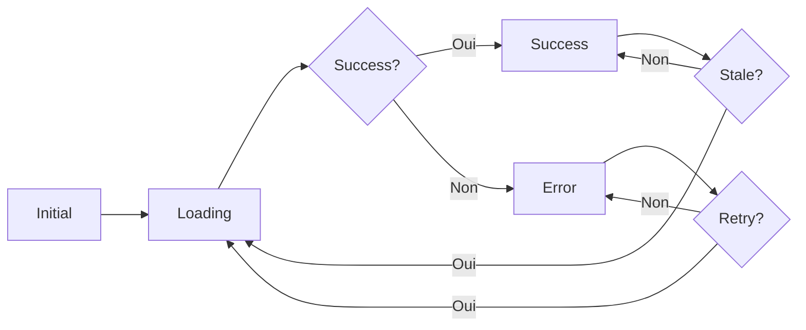

## Anatomie d'une Query

Une query Qora est composée de trois éléments essentiels :

```dart [main.dart]
await client.fetchQuery<User>(
  // 1️⃣ Query Key - Identifiant unique
  key: QoraKey(['user', userId]),
  
  // 2️⃣ Query Function - Fonction qui récupère les données
  fetcher: () => api.getUser(userId),
  
  // 3️⃣ Options (optionnel) - Configuration
  options: QoraOptions(
    staleTime: Duration(seconds: 30),
    cacheTime: Duration(minutes: 5),
  ),
);
```

### 1. Query Key

La **query key** est un identifiant unique pour votre query. Elle sert à :

- Identifier de manière unique les données dans le cache
- Déterminer quand refetch les données
- Invalider ou mettre à jour le cache

```dart [main.dart]
// Simple
QoraKey(['users'])

// Avec paramètres
QoraKey(['user', userId])

// Avec plusieurs paramètres
QoraKey(['posts', 'published', { 'authorId': authorId, 'page': page }])
```

:::tip
Les qora keys utilisent une **égalité profonde**. Cela signifie que `QoraKey(['user', 1])` est strictement égal à `QoraKey(['user', 1])`, même s'ils sont créés séparément.
:::

Voir [Qora Keys](./qora-keys.md) pour plus de détails.

### 2. Query Function

La **query function** est une fonction asynchrone qui retourne vos données :

```dart [main.dart]
// Simple
() => api.getUsers()

// Avec paramètres capturés
() => api.getUser(userId)

// Avec logique complexe
() async {
  final token = await authService.getToken();
  return api.getUserWithAuth(userId, token);
}
```

:::warning
La query function **doit** lancer une exception en cas d'erreur. Ne retournez pas `null` ou un état d'erreur.
:::

### 3. Options

Les **options** permettent de configurer le comportement de la query :

```dart [main.dart]
QoraOptions(
  // Durée pendant laquelle les données sont considérées fraîches
  staleTime: Duration(seconds: 30),
  
  // Durée de vie dans le cache
  cacheTime: Duration(minutes: 5),
  
  // Nombre de tentatives en cas d'erreur
  retryCount: 3,
  
  // Délai entre les tentatives
  retryDelay: Duration(seconds: 1),
  
  // Calculateur de délai personnalisé (exponentiel par défaut)
  retryDelayCalculator: (attempt) => Duration(seconds: attempt * 2),
)
```

## États d'une Query

Chaque query passe par différents états représentés par une `sealed class` :

```dart [main.dart]
sealed class QoraState<T> {
  // État initial - aucune donnée chargée
  const factory QoraState.initial();
  
  // En cours de chargement
  const factory QoraState.loading({T? previousData});
  
  // Succès
  const factory QoraState.success({
    required T data,
    required DateTime updatedAt,
  });
  
  // Erreur
  const factory QoraState.error({
    required Object error,
    StackTrace? stackTrace,
    T? previousData,
  });
}
```

### Pattern Matching

Utilisez la méthode `when()` pour gérer tous les états de manière exhaustive :

```dart [main.dart]
state.when(
  initial: () => Text('No data yet'),
  loading: (previousData) {
    if (previousData != null) {
      return Stack([
        DataView(data: previousData),
        LinearProgressIndicator(),
      ]);
    }
    return CircularProgressIndicator();
  },
  success: (data, updatedAt) => DataView(data: data),
  failure: (error, stackTrace, previousData) {
    return ErrorView(
      error: error,
      previousData: previousData,
    );
  },
)
```

### Helpers d'état

```dart [main.dart]
// Vérifier l'état
state.isLoading    // true si Loading
state.hasData      // true si Success ou Loading/Error avec previousData
state.hasError     // true si Error

// Récupérer les données
state.dataOrNull   // T? - données si disponibles
```

Voir [Query States](./query-states.md) pour plus de détails.

## Cycle de vie d'une Query



### 1. Création de la query

```dart [main.dart]
// La query est créée mais pas encore exécutée
final state = client.getState<User>(QoraKey(['user', 1]));
// state == QoraState.initial()
```

### 2. Premier fetch

```dart [main.dart]
// Déclenche le chargement
await client.fetchQuery<User>(
  QoraKey(['user', 1]),
  () => api.getUser(1),
);

// État pendant: QoraState.loading()
// État après succès: QoraState.success(data: user, updatedAt: now)
```

### 3. Mise en cache

Les données sont automatiquement mises en cache et restent disponibles pendant `cacheTime`.

```dart [main.dart]
// Deuxième appel - retourne immédiatement depuis le cache
final user = await client.fetchQuery<User>(
  QoraKey(['user', 1]),
  () => api.getUser(1),
);
// Pas de requête réseau si les données sont fraîches !
```

### 4. Revalidation (Stale-while-revalidate)

Après `staleTime`, les données sont marquées comme périmées :

```dart [main.dart]
// Si staleTime est dépassé :
// 1. Retourne immédiatement les données en cache
// 2. Lance un fetch en arrière-plan
// 3. Met à jour l'UI quand les nouvelles données arrivent

final user = await client.fetchQuery<User>(
  QoraKey(['user', 1]),
  () => api.getUser(1),
  options: QoraOptions(staleTime: Duration(seconds: 30)),
);
```

Voir [Stale-While-Revalidate](./stale-while-revalidate.md) pour plus de détails.

### 5. Éviction du cache

Après `cacheTime` sans utilisation, les données sont évincées du cache :

```dart
// Par défaut : cacheTime = 5 minutes
// Après 5 minutes sans utilisation, les données sont supprimées du cache
```

## Déduplication automatique

Si plusieurs composants demandent la même query simultanément, **un seul fetch** est exécuté :

```dart [main.dart]
// Ces trois appels ne déclenchent qu'UNE SEULE requête réseau
final future1 = client.fetchQuery<User>(QoraKey(['user', 1]), () => api.getUser(1));
final future2 = client.fetchQuery<User>(QoraKey(['user', 1]), () => api.getUser(1));
final future3 = client.fetchQuery<User>(QoraKey(['user', 1]), () => api.getUser(1));

// Tous retournent le même Future
```

Voir [Deduplication](./deduplication.md) pour plus de détails.

## Observer une Query

Utilisez `watchState()` pour obtenir un `Stream` qui émet les changements d'état :

```dart [main.dart]
final stream = client.watchState<User>(QoraKey(['user', 1]));

stream.listen((state) {
  state.when(
    success: (user, _) => print('User updated: ${user.name}'),
    failure: (err, _, __) => print('Error: $err'),
    loading: (_) => print('Loading...'),
    initial: () => print('Initial'),
  );
});
```

:::tip
Le stream émet **immédiatement** l'état actuel, puis les mises à jour futures. Parfait pour les `StreamBuilder` !
:::

## Invalidation manuelle

Forcez le rafraîchissement d'une query :

```dart [main.dart]
// Invalider une query spécifique
client.invalidateQuery(QoraKey(['user', 1]));

// Invalider plusieurs queries avec un prédicat
client.invalidateQueries((key) => key.parts.first == 'users');

// Invalider toutes les queries users
client.invalidateQueries((key) => key.parts.contains('users'));
```

## Mise à jour manuelle du cache

Mettez à jour directement les données dans le cache (utile pour les optimistic updates) :

```dart [main.dart]
// Mettre à jour manuellement
client.setQueryData<User>(
  QoraKey(['user', 1]),
  user.copyWith(name: 'New Name'),
);

// Les composants qui observent cette query seront notifiés !
```

## Exemple complet

```dart [repositories/user.repository.dart]
import 'package:qora/qora.dart';

class UserRepository {
  final QoraClient _client;
  final UserApi _api;

  UserRepository(this._client, this._api);

  // Récupérer un utilisateur
  Future<User> getUser(int userId) {
    return _client.fetchQuery<User>(
      key; QoraKey(['user', userId]),
      fetcher: () => _api.getUser(userId),
      decoder: (json) => User.fromJson(json)
      options: QoraOptions(
        staleTime: Duration(seconds: 30),
        retryCount: 3,
      ),
    );
  }

  // Observer un utilisateur
  Stream<QoraState<User>> watchUser(int userId) {
    return _client.watchState<User>(QoraKey(['user', userId]));
  }

  // Invalider le cache d'un utilisateur
  void invalidateUser(int userId) {
    _client.invalidateQuery(QoraKey(['user', userId]));
  }

  // Mettre à jour localement
  void updateUserLocally(User user) {
    _client.setQueryData<User>(
      QoraKey(['user', user.id]),
      user,
    );
  }
}
```

## Bonnes pratiques

### ✅ À faire

```dart [main.dart]
// Utiliser des query keys cohérentes
QoraKey(['user', userId])
QoraKey(['users', 'list'])
QoraKey(['posts', postId])

// Capturer les dépendances dans la query function
() => api.getUser(userId)  // userId capturé

// Gérer tous les états
state.when(
  initial: () => ...,
  loading: (_) => ...,
  success: (data, _) => ...,
  faulure: (err, _, __) => ...,
)
```

### ❌ À éviter

```dart [main.dart]
// Query keys incohérentes
QoraKey(['user', userId])
QoraKey([userId, 'user'])  // ❌ Ordre différent

// Retourner null au lieu de lancer une exception
() async {
  try {
    return await api.getUser(userId);
  } catch (e) {
    return null;  // ❌ Lance l'exception !
  }
}

// Ignorer des états
state.when(
  success: (data, _) => DataView(data),
  loading: (_) => Spinner(),
  // ❌ Manque initial et failure !
)
```

## Prochaines étapes

- [Query Keys](./query-keys.md) - Comprendre les clés en profondeur
- [Query States](./query-states.md) - Gestion avancée des états
- [Caching](./caching.md) - Stratégies de cache
- [Mutations](../guides/mutations.md) - Modifier les données
