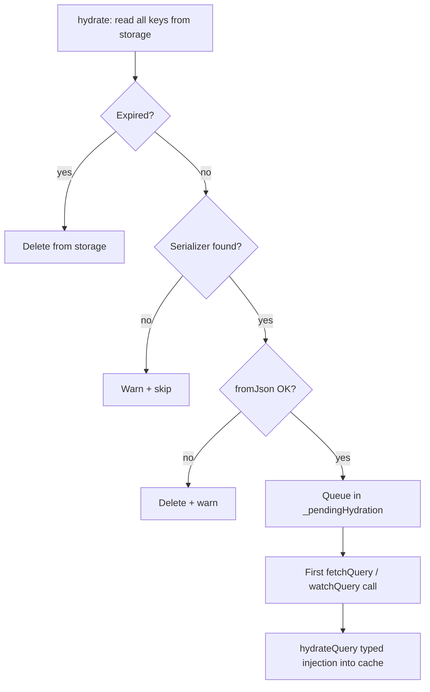

**Persistence** stores successful query results in a storage backend (Hive, Isar, SharedPreferences, and others) and restores them on application startup. The in-memory cache is hydrated before the first network request, including offline sessions.

This is built on three components in the `qora` package:

| Class | Role |
|---|---|
| `StorageAdapter` | Raw key/value contract for a storage backend |
| `QoraSerializer<T>` | Converts `T` ↔ JSON for a specific type |
| `PersistQoraClient` | Drop-in `QoraClient` replacement that wires everything together |

---

## Setup

### 1. Replace `QoraClient` with `PersistQoraClient`

```dart [main.dart]
import 'package:qora/qora.dart';

final client = PersistQoraClient(
  storage: InMemoryStorageAdapter(), // swap for a real adapter (see below)
  persistDuration: const Duration(days: 7),
  config: const QoraClientConfig(
    defaultOptions: QoraOptions(staleTime: Duration(minutes: 5)),
    debugMode: true, // prints [PersistQora] logs
  ),
);
```

`PersistQoraClient` extends `QoraClient`. Existing APIs such as `fetchQuery`, `watchQuery`, and `invalidate` remain unchanged.

---

### 2. Register serializers

Register a `QoraSerializer<T>` for every type you want to persist. Do this **before** calling `hydrate`.

```dart [main.dart]
// Single object
client.registerSerializer<User>(
  QoraSerializer(
    toJson:   (user) => user.toJson(),
    fromJson: User.fromJson,
  ),
  name: 'User', // explicit name: see Obfuscation section below
);

// Collection
client.registerSerializer<List<Post>>(
  QoraSerializer(
    toJson:   (posts) => posts.map((p) => p.toJson()).toList(),
    fromJson: (json)  => (json as List).map((e) => Post.fromJson(e)).toList(),
  ),
  name: 'List<Post>',
);

// Primitive: no conversion needed
client.registerSerializer<int>(
  QoraSerializer(toJson: (n) => n, fromJson: (json) => json as int),
  name: 'int',
);
```

Types without a registered serializer are fetched and cached in memory normally. They are not persisted to disk.

For projects with many models, see [Organising Serializers at Scale](#organising-serializers-at-scale) below.

---

### 3. Initialise storage, then hydrate

Awaiting `hydrate()` before `runApp` guarantees a warm cache on the first frame:

```dart [main.dart]
Future<void> main() async {
  WidgetsFlutterBinding.ensureInitialized();

  await storage.init();         // open the database / file
  await client.hydrate();       // warm cache from disk

  runApp(QoraScope(client: client, child: const MyApp()));
}
```

If `hydrate()` is measurably slow (large number of stored entries: verify with profiling before optimising), show a **splash screen** while the future runs rather than blocking `runApp`:

```dart [main.dart]
void main() {
  WidgetsFlutterBinding.ensureInitialized();

  runApp(
    QoraScope(
      client: client,
      child: FutureBuilder<void>(
        future: storage.init().then((_) => client.hydrate()),
        builder: (context, snapshot) {
          if (snapshot.connectionState != ConnectionState.done) {
            return const MaterialApp(home: SplashScreen());
          }
          return const MyApp();
        },
      ),
    ),
  );
}
```

In practice, `hydrate()` reads a handful of JSON strings from local storage. For most apps the `before runApp` pattern is simpler and fast enough.

---

## How It Works

### Auto-persist (write-through)

After every successful fetch: whether triggered directly or by SWR background revalidation: the result is written to `StorageAdapter` as a JSON envelope containing:

- the serialised data
- a type discriminator (`typeName`)
- the timestamp (`persistedAt`)
- the TTL in milliseconds

No extra code needed. As long as the type has a registered serializer, it is persisted automatically.

---

### Lazy typed hydration

`hydrate()` deserialises stored entries but does **not** inject them into the cache immediately. Instead, it queues them in an internal map. On the first call to `fetchQuery<T>`, `watchQuery<T>`, `getQueryData<T>`, etc., the queued entry is consumed and injected as a correctly-typed `CacheEntry<T>`.

This avoids a Dart runtime cast failure: `CacheEntry<dynamic> as CacheEntry<User>` throws, but `CacheEntry<User>` created by `hydrateQuery<User>` does not.

---

### SWR and freshness

The restored `Success` state carries the original `persistedAt` as its `updatedAt` timestamp. This means `staleTime` works exactly as in-memory:

- `persistedAt` is recent → entry is **fresh** → no network call on mount
- `persistedAt` is old → entry is **stale** → widget shows cached data immediately, then revalidates in background (SWR)

```dart [main.dart]
// staleTime: 5 minutes
// If the last fetch was 3 minutes ago → still fresh → no spinner on restart
// If the last fetch was 8 minutes ago → show cached data + background refetch
```

---

## TTL (Time To Live)

### Global TTL

Set once on `PersistQoraClient`:

```dart [main.dart]
final client = PersistQoraClient(
  storage: adapter,
  persistDuration: const Duration(days: 7), // default
);
```

Pass `Duration.zero` to persist indefinitely (until `removeQuery` or `evictFromStorage` is called explicitly).

---

### Per-query TTL override

Pass `ttl:` when calling `persistQuery` manually:

```dart [main.dart]
// Force-persist the current cached value with a custom TTL
await client.persistQuery<User>(['users', userId], ttl: const Duration(hours: 1));
```

---

### What happens to expired entries on hydrate?

Expired entries are **deleted from storage and skipped**: they are never injected into the cache. The next successful fetch will write a fresh entry.



### Model versioning and migrations

If your model schema changes between app releases: a required field added to `User`, a field renamed, a type changed: persisted entries written by the old version may fail to deserialise with the new `fromJson`.

`PersistQoraClient` intercepts every `fromJson` exception during `hydrate`, logs a warning (when `debugMode` is `true`), deletes the corrupt entry from storage, and moves on. The app never crashes because of a stale schema on disk.

Your responsibility is to write a defensive `fromJson` that handles both old and new shapes:

```dart [models/user.dart]
factory User.fromJson(dynamic json) {
  final map = json as Map<String, dynamic>;
  return User(
    id:       map['id'] as int,
    name:     map['name'] as String,
    // Added in v2: default to empty string for entries persisted by v1
    avatarUrl: map['avatarUrl'] as String? ?? '',
  );
}
```

For **breaking changes** (field removal, type change with no safe default), bump the serializer `name`: e.g. `'User'` → `'User_v2'`. Old entries are silently skipped on hydration (no serializer registered for the old name), the user gets a fresh network fetch on that run, and future writes use the new schema. Old entries are eventually purged by TTL expiry.

---

## Storage Eviction Semantics

| Operation | In-memory cache | Storage |
|---|---|---|
| `invalidate(key)` | Marks stale, triggers refetch | **Untouched** |
| `removeQuery(key)` | Removed | Deleted |
| `clear()` | Cleared | Cleared |
| `evictFromStorage(key)` | Untouched | Deleted |
| `clearStorage()` | Untouched | Cleared |

`invalidate` intentionally does **not** delete from storage. The intent is to refetch, not purge. The next successful fetch will overwrite the stored entry with fresh data.

---

## Obfuscation and Flutter Web

On Flutter Web or when Dart's `--obfuscate` flag is active, `T.toString()` is replaced by a short minified identifier (`a`, `b`, …). If `registerSerializer` is called without an explicit `name`, the type discriminator written to disk becomes unreadable on the next cold start.

**Always pass `name:` explicitly** when targeting these configurations:

```dart [main.dart]
// ✅ Stable: name is hardcoded, never changes
client.registerSerializer<User>(userSerializer, name: 'User');
client.registerSerializer<List<Post>>(postListSerializer, name: 'List<Post>');

// ❌ Unsafe on Flutter Web / --obfuscate
client.registerSerializer<User>(userSerializer); // name defaults to User.toString()
```

The `name` must remain **stable across app versions**. Changing it will cause all previously persisted entries for that type to be silently skipped on the next `hydrate`.

---

## Organising Serializers at Scale

For small projects (< 10 models), inline `registerSerializer` calls in `main.dart` are fine. As your app grows, the registrations need structure.

---

### The problem with inline registration

With 20+ models, `main.dart` becomes a maintenance burden:

```dart [main.dart]
// ❌ Unmanageable at scale
client.registerSerializer<User>(...);
client.registerSerializer<Post>(...);
client.registerSerializer<Comment>(...);
client.registerSerializer<Product>(...);
// 20 more lines...
await client.hydrate();
```

---

### Recommended: satellite `_serializer.dart` files

Keep your model **pure** (no Qora dependency) and place its serializer in a dedicated satellite file next to it:

```text
features/
  user/
    models/
      user.dart             ← pure data class, no Qora import
      user_serializer.dart  ← QoraSerializer lives here
  post/
    models/
      post.dart
      post_serializer.dart
```

```dart [features/user/models/user.dart]
// No Qora import: model is fully portable
class User {
  final int id;
  final String name;

  const User({required this.id, required this.name});

  factory User.fromJson(dynamic json) {
    final map = json as Map<String, dynamic>;
    return User(id: map['id'] as int, name: map['name'] as String);
  }

  Map<String, dynamic> toJson() => {'id': id, 'name': name};
}
```

```dart [features/user/models/user_serializer.dart]
import 'package:qora/qora.dart';
import 'user.dart';

final userSerializer = QoraSerializer<User>(
  toJson:   (u) => u.toJson(),
  fromJson: User.fromJson,
);

final userListSerializer = QoraSerializer<List<User>>(
  toJson:   (list) => list.map((u) => u.toJson()).toList(),
  fromJson: (json) => (json as List).map(User.fromJson).toList(),
);
```

This pattern has three benefits:

- **Model stays portable**: reusable with a Dart backend, other packages, or a different cache engine without dragging a Qora dependency
- **Tree-shaking**: if `user_serializer.dart` is never imported, it is not compiled
- **Multi-format friendly**: you can add `user_firestore.dart`, `user_supabase.dart` etc. without touching the model

---

### Central registration function

Collect all satellite serializers in one file: `main.dart` calls a single function:

```dart [lib/core/persistence/serializers.dart]
import 'package:qora/qora.dart';
import '../../features/user/models/user_serializer.dart';
import '../../features/post/models/post_serializer.dart';
import '../../features/product/models/product_serializer.dart';

void registerAllSerializers(PersistQoraClient client) {
  client.registerSerializer<User>(userSerializer,           name: 'User');
  client.registerSerializer<List<User>>(userListSerializer, name: 'List<User>');
  client.registerSerializer<Post>(postSerializer,           name: 'Post');
  client.registerSerializer<Product>(productSerializer,     name: 'Product');
}
```

```dart [main.dart]
registerAllSerializers(client); // ← single call, regardless of model count
await client.hydrate();
runApp(...);
```

This file also becomes the authoritative list of every type that gets persisted: useful for auditing and migrations.

---

### Alternative: `static const` on the model class

If your model lives entirely within the Flutter app and `qora` is a core dependency with no plans to share the model elsewhere, a `static const` serializer on the class itself is acceptable and offers the best autocompletion:

```dart [features/user/models/user.dart]
import 'package:qora/qora.dart';

class User {
  // ...

  static const serializer = QoraSerializer<User>(
    toJson:   _encode,
    fromJson: User.fromJson,
  );

  static Map<String, dynamic> _encode(User u) => u.toJson();
}
```

```dart [lib/core/persistence/serializers.dart]
client.registerSerializer<User>(User.serializer, name: 'User');
```

This approach is simpler but couples the model to Qora. Avoid it if the model is shared across packages or with a backend.

> **Note on Dart extensions:** `static const` members defined inside a Dart `extension` block are accessed via the *extension name* (`UserQoraExt.serializer`), not via the class (`User.serializer`). If you want `User.serializer` syntax, the static must be on the class itself, not on an extension.

---

### Decision guide

| Context | Pattern |
|---|---|
| < 10 models, small app | Inline in `main.dart` |
| Model shared with backend or other packages | `_serializer.dart` satellite (mandatory) |
| Feature-first architecture, 15+ models | `_serializer.dart` + `registerAllSerializers()` |
| Model is Flutter-only, DX is top priority | `static const` on the class |

---

## Storage Adapters

The built-in `InMemoryStorageAdapter` is useful for tests. For real apps, use one of the external adapter packages:

| Package | Backend |
|---|---|
| `qora_storage_shared_prefs` | `SharedPreferences`: simple, no extra setup |
| `qora_storage_hive` | Hive: fast, no native dependencies |
| `qora_storage_isar` | Isar: reactive, efficient binary format |
| `qora_storage_drift` | Drift / SQLite: relational, great for complex queries |

All adapters implement the same `StorageAdapter` interface: switching backends requires changing one line.

---

## Full Flutter Example

```dart [main.dart]
import 'package:flutter/material.dart';
import 'package:qora_flutter/qora_flutter.dart';
import 'package:qora/qora.dart';

Future<void> main() async {
  WidgetsFlutterBinding.ensureInitialized();

  final storage = InMemoryStorageAdapter(); // replace with HiveStorageAdapter()
  await storage.init();

  final client = PersistQoraClient(
    storage: storage,
    persistDuration: const Duration(days: 7),
    config: const QoraClientConfig(
      defaultOptions: QoraOptions(staleTime: Duration(minutes: 5)),
    ),
  );

  client.registerSerializer<User>(
    QoraSerializer(toJson: (u) => u.toJson(), fromJson: User.fromJson),
    name: 'User',
  );
  client.registerSerializer<List<Post>>(
    QoraSerializer(
      toJson:   (posts) => posts.map((p) => p.toJson()).toList(),
      fromJson: (json)  => (json as List).map((e) => Post.fromJson(e)).toList(),
    ),
    name: 'List<Post>',
  );

  await client.hydrate(); // warm cache from disk

  runApp(
    QoraScope(
      client: client,
      lifecycleManager: FlutterLifecycleManager(qoraClient: client),
      child: const MyApp(),
    ),
  );
}
```

```dart [screens/posts_screen.dart]
class PostsScreen extends StatelessWidget {
  const PostsScreen({super.key});

  @override
  Widget build(BuildContext context) {
    return QoraBuilder<List<Post>>(
      queryKey: ['posts'],
      queryFn: PostApi.fetchAll,
      // If hydrated data exists: shown instantly, no spinner.
      // If stale: shown immediately while refetching in background.
      builder: (context, state) => switch (state) {
        Initial()                              => const SizedBox.shrink(),
        Loading(previousData: null)            => const CircularProgressIndicator(),
        Loading(:final previousData?)          => PostList(previousData),
        Success(:final data)                   => PostList(data),
        Failure(:final error, previousData: null) => ErrorView('$error'),
        Failure(:final error, :final previousData?) => Column(children: [
            PostList(previousData),
            ErrorBanner('Refresh failed: $error'),
          ]),
      },
    );
  }
}
```

On the first launch, `PostsScreen` shows a spinner and fetches from the network. On every subsequent launch, the posts list appears instantly from disk while Qora revalidates in the background if the data is stale.

---

## Logout / Account Switch

When the user logs out, clear both in-memory cache and storage in one call:

```dart [auth_service.dart]
Future<void> logout() async {
  await api.logout();
  client.clear(); // wipes cache + storage atomically
  Navigator.pushReplacementNamed(context, '/login');
}
```

---

## Next Steps

- [PersistQoraClient API](../api-reference/persist-qora-client.md): full method reference
- [Optimistic Updates](./optimistic-updates.md): combine persistence with optimistic UI
- [QoraClient API](../api-reference/qora-client.md): base client reference
