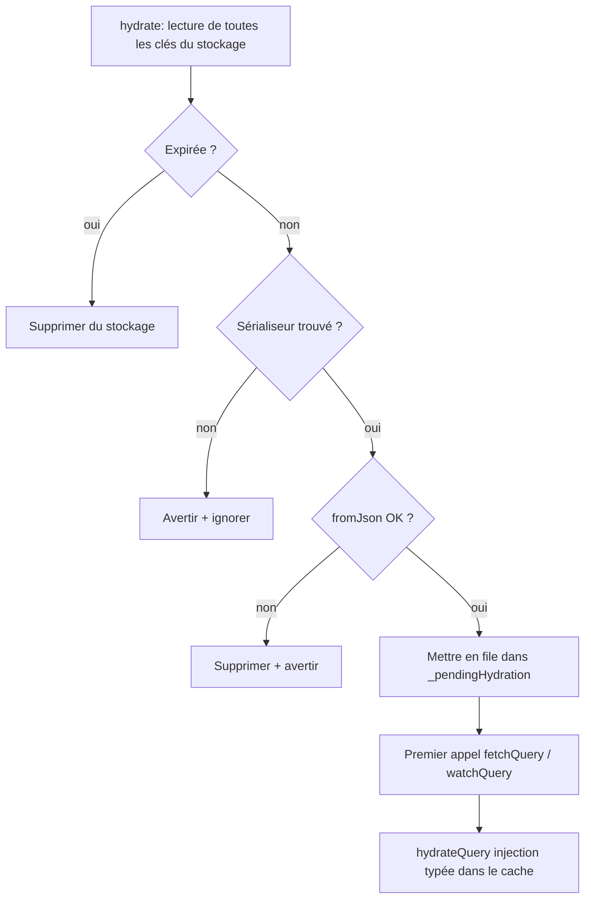

La **persistance** stocke les résultats de requêtes réussies dans un backend de stockage (Hive, Isar, SharedPreferences et autres) et les restaure au démarrage de l'application. Le cache en mémoire est hydraté avant la première requête réseau, y compris lors des sessions hors-ligne.

Ce mécanisme repose sur trois composants du package `qora` :

| Classe              | Rôle                                                    |
|---------------------|---------------------------------------------------------|
| `StorageAdapter`    | Contrat clé/valeur brut pour un backend de stockage     |
| `QoraSerializer<T>` | Convertit `T` ↔ JSON pour un type spécifique            |
| `PersistQoraClient` | Remplacement clé-en-main de `QoraClient` qui câble tout |

---

## Configuration

### 1. Remplacer `QoraClient` par `PersistQoraClient`

```dart [main.dart]
import 'package:qora/qora.dart';

final client = PersistQoraClient(
  storage: InMemoryStorageAdapter(), // remplacer par un vrai adaptateur (voir ci-dessous)
  persistDuration: const Duration(days: 7),
  config: const QoraClientConfig(
    defaultOptions: QoraOptions(staleTime: Duration(minutes: 5)),
    debugMode: true, // affiche les logs [PersistQora]
  ),
);
```

`PersistQoraClient` étend `QoraClient`. Les APIs existantes comme `fetchQuery`, `watchQuery` et `invalidate` restent inchangées.

---

### 2. Enregistrer les sérialiseurs

Enregistrer un `QoraSerializer<T>` pour chaque type à persister. Le faire **avant** d'appeler `hydrate`.

```dart [main.dart]
// Objet unique
client.registerSerializer<User>(
  QoraSerializer(
    toJson: (user) => user.toJson(),
    fromJson: User.fromJson,
  ),
  name: 'User', // nom explicite : voir la section Obfuscation ci-dessous
);

// Collection
client.registerSerializer<List<Post>>(
  QoraSerializer(
    toJson: (posts) => posts.map((p) => p.toJson()).toList(),
    fromJson: (json) => (json as List).map((e) => Post.fromJson(e)).toList(),
  ),
  name: 'List<Post>',
);

// Primitif : aucune conversion nécessaire
client.registerSerializer<int>(
  QoraSerializer(toJson: (n) => n, fromJson: (json) => json as int),
  name: 'int',
);
```

Les types sans sérialiseur enregistré sont récupérés et mis en cache en mémoire normalement. Ils ne sont pas persistés sur disque.

Pour les projets avec de nombreux modèles, voir [Organisation des sérialiseurs à grande échelle](#organisation-des-sérialiseurs-à-grande-échelle) ci-dessous.

---

### 3. Initialiser le stockage, puis hydrater

Attendre `hydrate()` avant `runApp` garantit un cache chaud dès la première frame :

```dart [main.dart]
Future<void> main() async {
  WidgetsFlutterBinding.ensureInitialized();

  await storage.init();         // ouvrir la base de données / le fichier
  await client.hydrate();       // chauffer le cache depuis le disque

  runApp(QoraScope(client: client, child: const MyApp()));
}
```

Si `hydrate()` est mesurément lent (grand nombre d'entrées stockées : vérifier avec du profiling avant d'optimiser), afficher un **écran de démarrage** pendant l'exécution du Future plutôt que de bloquer `runApp` :

```dart [main.dart]
void main() {
  WidgetsFlutterBinding.ensureInitialized();

  runApp(
    QoraScope(
      client: client,
      child: FutureBuilder<void>(
        future: storage.init().then((_) => client.hydrate()),
        builder: (context, snapshot) {
          if (snapshot.connectionState != ConnectionState.done) {
            return const MaterialApp(home: SplashScreen());
          }
          return const MyApp();
        },
      ),
    ),
  );
}
```

En pratique, `hydrate()` lit une poignée de chaînes JSON depuis le stockage local. Pour la plupart des applications, le pattern `before runApp` est plus simple et suffisamment rapide.

---

## Fonctionnement

### Persistance automatique (write-through)

Après chaque fetch réussi, qu'il soit déclenché directement ou par la revalidation SWR en arrière-plan, le résultat est écrit dans `StorageAdapter` sous forme d'enveloppe JSON contenant :

- les données sérialisées
- un discriminateur de type (`typeName`)
- l'horodatage (`persistedAt`)
- le TTL en millisecondes

Aucun code supplémentaire n'est nécessaire. Tant que le type dispose d'un sérialiseur enregistré, il est persisté automatiquement.

---

### Hydratation typée paresseuse

`hydrate()` désérialise les entrées stockées mais ne les injecte **pas** immédiatement dans le cache. Il les met en file dans une map interne. Lors du premier appel à `fetchQuery<T>`, `watchQuery<T>`, `getQueryData<T>`, etc., l'entrée en file est consommée et injectée comme `CacheEntry<T>` correctement typé.

Cela évite un échec de cast runtime Dart : `CacheEntry<dynamic> as CacheEntry<User>` lève une exception, mais `CacheEntry<User>` créé par `hydrateQuery<User>` non.

---

### SWR et fraîcheur

L'état `Success` restauré porte le `persistedAt` original comme horodatage `updatedAt`. Cela signifie que `staleTime` fonctionne exactement comme en mémoire :

- `persistedAt` est récent → entrée **fraîche** → pas d'appel réseau au montage
- `persistedAt` est ancien → entrée **périmée** → widget affiche les données en cache immédiatement, puis revalide en arrière-plan (SWR)

```dart [main.dart]
// staleTime: 5 minutes
// Si le dernier fetch était il y a 3 minutes → encore frais → pas de spinner au redémarrage
// Si le dernier fetch était il y a 8 minutes → afficher les données en cache + refetch en arrière-plan
```

---

## TTL (Time To Live)

### TTL global

Défini une fois sur `PersistQoraClient` :

```dart [main.dart]
final client = PersistQoraClient(
  storage: adapter,
  persistDuration: const Duration(days: 7), // valeur par défaut
);
```

Passer `Duration.zero` pour persister indéfiniment (jusqu'à ce que `removeQuery` ou `evictFromStorage` soit appelé explicitement).

---

### Surcharge TTL par requête

Passer `ttl:` lors d'un appel manuel à `persistQuery` :

```dart [main.dart]
// Forcer la persistance de la valeur courante en cache avec un TTL personnalisé
await client.persistQuery<User>(['users', userId], ttl: const Duration(hours: 1));
```

---

### Que se passe-t-il avec les entrées expirées lors de l'hydratation ?

Les entrées expirées sont **supprimées du stockage et ignorées** : elles ne sont jamais injectées dans le cache. Le prochain fetch réussi écrira une entrée fraîche.



### Versionnement des modèles et migrations

Si le schéma du modèle change entre les versions de l'application, champ requis ajouté à `User`, champ renommé, type changé, les entrées persistées par l'ancienne version peuvent échouer à la désérialisation avec le nouveau `fromJson`.

`PersistQoraClient` intercepte chaque exception `fromJson` lors de `hydrate`, journalise un avertissement (quand `debugMode` est `true`), supprime l'entrée corrompue du stockage et continue. L'application ne plante jamais à cause d'un schéma obsolète sur le disque.

La responsabilité est d'écrire un `fromJson` défensif qui gère les anciennes et nouvelles formes :

```dart [models/user.dart]
factory User.fromJson(dynamic json) {
  final map = json as Map<String, dynamic>;
  return User(
    id: map['id'] as int,
    name: map['name'] as String,
    // Ajouté en v2 : valeur par défaut chaîne vide pour les entrées persistées par v1
    avatarUrl: map['avatarUrl'] as String? ?? '',
  );
}
```

Pour les **changements cassants** (suppression de champ, changement de type sans valeur par défaut sûre), incrémenter le `name` du sérialiseur : ex. `'User'` → `'User_v2'`. Les anciennes entrées sont silencieusement ignorées lors de l'hydratation (aucun sérialiseur enregistré pour l'ancien nom), l'utilisateur obtient un fetch réseau frais lors de cette exécution, et les futures écritures utilisent le nouveau schéma. Les anciennes entrées sont finalement purgées par expiration du TTL.

---

## Sémantique d'éviction du stockage

| Opération | Cache en mémoire | Stockage |
|---|---|---|
| `invalidate(key)` | Marqué périmé, déclenche un refetch | **Inchangé** |
| `removeQuery(key)` | Supprimé | Supprimé |
| `clear()` | Vidé | Vidé |
| `evictFromStorage(key)` | Inchangé | Supprimé |
| `clearStorage()` | Inchangé | Vidé |

`invalidate` ne supprime **pas** intentionnellement du stockage. L'intention est de refetcher, pas de purger. Le prochain fetch réussi écrasera l'entrée stockée avec des données fraîches.

---

## Obfuscation et Flutter Web

Sur Flutter Web ou quand le flag `--obfuscate` de Dart est actif, `T.toString()` est remplacé par un identifiant court minifié (`a`, `b`, …). Si `registerSerializer` est appelé sans `name` explicite, le discriminateur de type écrit sur le disque devient illisible au prochain démarrage à froid.

**Toujours passer `name:` explicitement** pour ces configurations :

```dart [main.dart]
// ✅ Stable : le nom est codé en dur, ne change jamais
client.registerSerializer<User>(userSerializer, name: 'User');
client.registerSerializer<List<Post>>(postListSerializer, name: 'List<Post>');

// ❌ Non sûr sur Flutter Web / --obfuscate
client.registerSerializer<User>(userSerializer); // name par défaut à User.toString()
```

Le `name` doit rester **stable entre les versions de l'application**. Le changer causera la désérialisation silencieuse de toutes les entrées précédemment persistées pour ce type lors du prochain `hydrate`.

---

## Organisation des sérialiseurs à grande échelle

Pour les petits projets (< 10 modèles), les appels inline à `registerSerializer` dans `main.dart` conviennent. À mesure que l'application croît, les enregistrements nécessitent une structure.

---

### Le problème de l'enregistrement inline

Avec 20+ modèles, `main.dart` devient difficile à maintenir :

```dart [main.dart]
// ❌ Non gérable à grande échelle
client.registerSerializer<User>(...);
client.registerSerializer<Post>(...);
client.registerSerializer<Comment>(...);
client.registerSerializer<Product>(...);
// 20 lignes de plus...
await client.hydrate();
```

---

### Recommandé : fichiers `_serializer.dart` satellites

Garder le modèle **pur** (sans dépendance Qora) et placer son sérialiseur dans un fichier satellite dédié à côté de lui :

```text
features/
  user/
    models/
      user.dart             ← classe de données pure, pas d'import Qora
      user_serializer.dart  ← QoraSerializer ici
  post/
    models/
      post.dart
      post_serializer.dart
```

```dart [features/user/models/user.dart]
// Pas d'import Qora : le modèle est entièrement portable
class User {
  final int id;
  final String name;

  const User({required this.id, required this.name});

  factory User.fromJson(dynamic json) {
    final map = json as Map<String, dynamic>;
    return User(id: map['id'] as int, name: map['name'] as String);
  }

  Map<String, dynamic> toJson() => {'id': id, 'name': name};
}
```

```dart [features/user/models/user_serializer.dart]
import 'package:qora/qora.dart';
import 'user.dart';

final userSerializer = QoraSerializer<User>(
  toJson: (u) => u.toJson(),
  fromJson: User.fromJson,
);

final userListSerializer = QoraSerializer<List<User>>(
  toJson: (list) => list.map((u) => u.toJson()).toList(),
  fromJson: (json) => (json as List).map(User.fromJson).toList(),
);
```

Ce pattern présente trois avantages :

- **Modèle portable** : réutilisable avec un backend Dart, d'autres packages ou un moteur de cache différent sans traîner une dépendance Qora
- **Tree-shaking** : si `user_serializer.dart` n'est jamais importé, il n'est pas compilé
- **Multi-format** : possibilité d'ajouter `user_firestore.dart`, `user_supabase.dart` etc. sans toucher au modèle

---

### Fonction d'enregistrement centralisée

Collecter tous les sérialiseurs satellites dans un fichier : `main.dart` appelle une seule fonction :

```dart [lib/core/persistence/serializers.dart]
import 'package:qora/qora.dart';
import '../../features/user/models/user_serializer.dart';
import '../../features/post/models/post_serializer.dart';
import '../../features/product/models/product_serializer.dart';

void registerAllSerializers(PersistQoraClient client) {
  client.registerSerializer<User>(userSerializer, name: 'User');
  client.registerSerializer<List<User>>(userListSerializer, name: 'List<User>');
  client.registerSerializer<Post>(postSerializer, name: 'Post');
  client.registerSerializer<Product>(productSerializer, name: 'Product');
}
```

```dart [main.dart]
registerAllSerializers(client); // ← appel unique, quel que soit le nombre de modèles
await client.hydrate();
runApp(...);
```

Ce fichier devient également la liste autoritaire de tous les types persistés : utile pour l'audit et les migrations.

---

### Alternative : `static const` sur la classe du modèle

Si le modèle vit entièrement dans l'application Flutter et que `qora` est une dépendance principale sans plans de partage du modèle ailleurs, un sérialiseur `static const` sur la classe elle-même est acceptable et offre la meilleure autocomplétion :

```dart [features/user/models/user.dart]
import 'package:qora/qora.dart';

class User {
  // ...

  static const serializer = QoraSerializer<User>(
    toJson: _encode,
    fromJson: User.fromJson,
  );

  static Map<String, dynamic> _encode(User u) => u.toJson();
}
```

```dart [lib/core/persistence/serializers.dart]
client.registerSerializer<User>(User.serializer, name: 'User');
```

Cette approche est plus simple mais couple le modèle à Qora. L'éviter si le modèle est partagé entre packages ou avec un backend.

> **Note sur les extensions Dart :** les membres `static const` définis dans un bloc `extension` Dart sont accédés via le *nom de l'extension* (`UserQoraExt.serializer`), pas via la classe (`User.serializer`). Pour la syntaxe `User.serializer`, le static doit être sur la classe elle-même, pas sur une extension.

---

### Guide de décision

| Contexte | Pattern |
|---|---|
| < 10 modèles, petite application | Inline dans `main.dart` |
| Modèle partagé avec un backend ou d'autres packages | Satellite `_serializer.dart` (obligatoire) |
| Architecture feature-first, 15+ modèles | `_serializer.dart` + `registerAllSerializers()` |
| Modèle Flutter uniquement, DX prioritaire | `static const` sur la classe |

---

## Adaptateurs de stockage

L'`InMemoryStorageAdapter` intégré est utile pour les tests. Pour les applications réelles, utiliser l'un des packages d'adaptateurs externes :

| Package | Backend |
|---|---|
| `qora_storage_shared_prefs` | `SharedPreferences` : simple, pas de configuration supplémentaire |
| `qora_storage_hive` | Hive : rapide, pas de dépendances natives |
| `qora_storage_isar` | Isar : réactif, format binaire efficace |
| `qora_storage_drift` | Drift / SQLite : relationnel, adapté aux requêtes complexes |

Tous les adaptateurs implémentent la même interface `StorageAdapter` : changer de backend nécessite de modifier une seule ligne.

---

## Exemple Flutter complet

```dart [main.dart]
import 'package:flutter/material.dart';
import 'package:qora_flutter/qora_flutter.dart';
import 'package:qora/qora.dart';

Future<void> main() async {
  WidgetsFlutterBinding.ensureInitialized();

  final storage = InMemoryStorageAdapter(); // remplacer par HiveStorageAdapter()
  await storage.init();

  final client = PersistQoraClient(
    storage: storage,
    persistDuration: const Duration(days: 7),
    config: const QoraClientConfig(
      defaultOptions: QoraOptions(staleTime: Duration(minutes: 5)),
    ),
  );

  client.registerSerializer<User>(
    QoraSerializer(toJson: (u) => u.toJson(), fromJson: User.fromJson),
    name: 'User',
  );
  client.registerSerializer<List<Post>>(
    QoraSerializer(
      toJson: (posts) => posts.map((p) => p.toJson()).toList(),
      fromJson: (json)  => (json as List).map((e) => Post.fromJson(e)).toList(),
    ),
    name: 'List<Post>',
  );

  await client.hydrate(); // chauffer le cache depuis le disque

  runApp(
    QoraScope(
      client: client,
      lifecycleManager: FlutterLifecycleManager(qoraClient: client),
      child: const MyApp(),
    ),
  );
}
```

```dart [screens/posts_screen.dart]
class PostsScreen extends StatelessWidget {
  const PostsScreen({super.key});

  @override
  Widget build(BuildContext context) {
    return QoraBuilder<List<Post>>(
      queryKey: ['posts'],
      fetcher: PostApi.fetchAll,
      // Si les données hydratées existent : affichées instantanément, pas de spinner.
      // Si périmées : affichées immédiatement pendant le refetch en arrière-plan.
      builder: (context, state, fetchStatus) => switch (state) {
        Initial() => const SizedBox.shrink(),
        Loading(previousData: null) => const CircularProgressIndicator(),
        Loading(:final previousData?) => PostList(previousData),
        Success(:final data) => PostList(data),
        Failure(:final error, previousData: null) => ErrorView('$error'),
        Failure(:final error, :final previousData?) => Column(children: [
            PostList(previousData),
            ErrorBanner('Rafraîchissement échoué : $error'),
          ]),
      },
    );
  }
}
```

Lors du premier lancement, `PostsScreen` affiche un spinner et récupère depuis le réseau. Lors de chaque lancement suivant, la liste de posts apparaît instantanément depuis le disque pendant que Qora revalide en arrière-plan si les données sont périmées.

---

## Déconnexion / changement de compte

Quand l'utilisateur se déconnecte, vider le cache en mémoire et le stockage en un seul appel :

```dart [auth_service.dart]
Future<void> logout() async {
  await api.logout();
  client.clear(); // vide le cache + stockage de façon atomique
  Navigator.pushReplacementNamed(context, '/login');
}
```

---

## Étapes suivantes

- [API PersistQoraClient](../api-reference/persist-qora-client.md) : référence complète des méthodes
- [Mises à jour optimistes](./optimistic-updates.md) : combiner la persistance avec une UI optimiste
- [API QoraClient](../api-reference/qora-client.md) : référence du client de base
